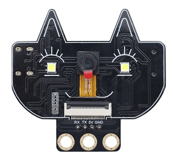
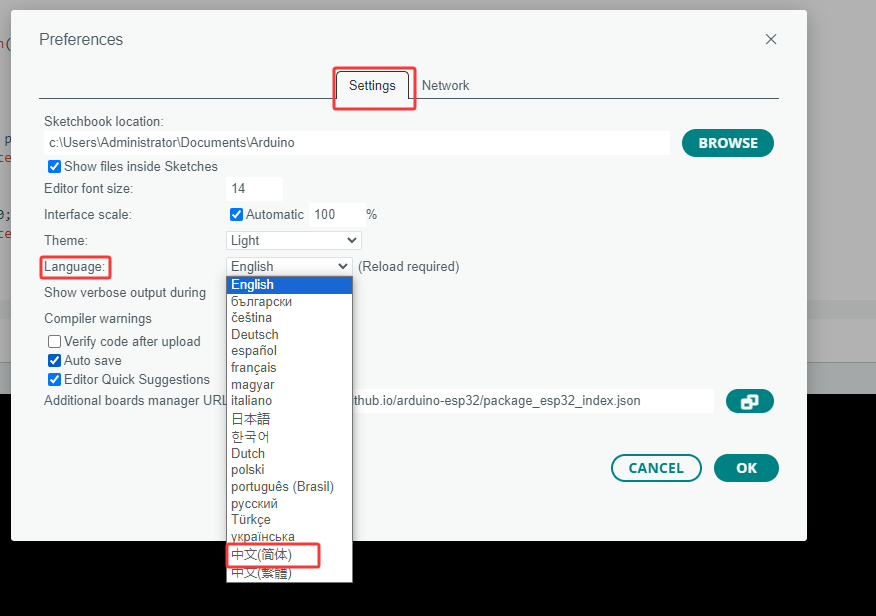
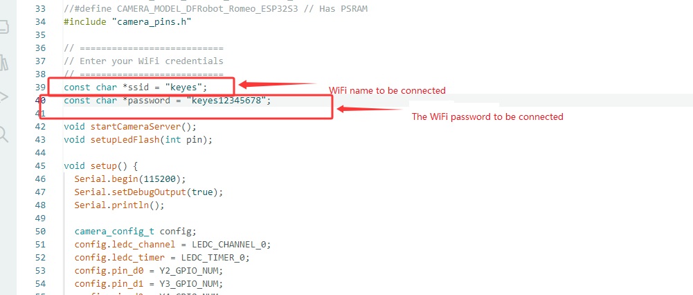
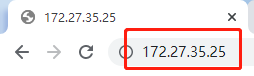
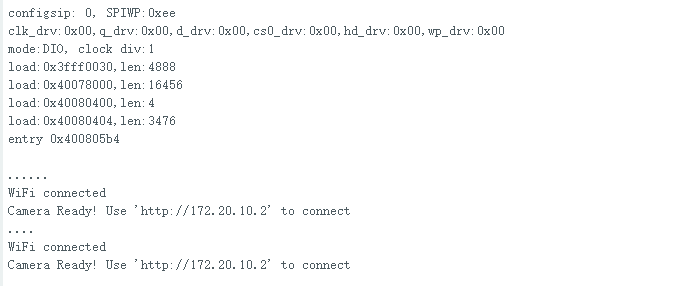
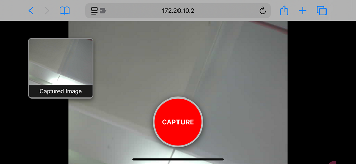

# MB0198 Cat Face Camera Black Eco-friendly



## Description

The cat face camera adopts the ESP32-S module and the OV3660 camera module. It can operate independently in minimum system and can be applied in various Internet of Things applications, such as home smart devices, industrial wireless control, wireless monitoring, QR code recognition, wireless positioning system signals. It also supports secondary development and various Internet of Things device applications.

## Parameters

- It adopts a low-power, dual-core 32-bit CPU and can be used as an application processor.
- The main frequency is as high as 240MHz and the computing power reaches 600 DMIPS.
- Built-in 520 KB SRAM and external 8MB PSRAM.
- Compatible with UART.
- Supports OV2640 and OV3660 cameras, with built-in flash.
- Supports TF card, multiple sleep modes, WIFI upload and STA/AP/STA+AP working modes.
- Built-in Lwip and FreeRTOS.
- Support Smart Config/AirKiss intelligent configuration.
- Power range: 5V
- Average operating current: 0.21A
- Product dimensions: 55*51mm

## Connection & Environment Configuration

**Arduino IDE (Windows)**

Arduino official: https://www.arduino.cc/en/software/#ide

Download the latest version of the arduino. After entering the website，as shown below:

There are many versions of Arduino, including those for Windows,mac and linux systems, as well as older ones. You just need to download a version that suits your system.


Here, we take the Windows system as an example to introduce the steps of downloading and installing. There are also two versions of the Windows system: one for installation, one for download(no need to install and just unzip it to use).


Click JUST DOWNLOAD.

**Environment Configuration**

Step 1: Connect the computer to the camera via a Type-C data cable;

Step 2: Open Arduino IDE, File-->Preferences-->Setings-->Lauguage; you can change the language.




Set up the test environment:
If you see  in the board types of the Arduino IDE, jump to Settings environment.

Configure esp32: Go to Arduino-->File-->Preferences, 
Configure ESP url
Copy “https://dl.espressif.com/dl/package_esp32_index.json” to “Additional Board Manager URLs”.


Configure the development board: Open Tools --> Board: (Arduino UNO) --> Board Manager.
Search for esp32, select the version and install it.


## Sample Code 1

Ensure that the serial port and board model are correct.


Select the sample code.


Modify the camera type to CAMERA_MODEL_AI_THINKER


Configure WiFi: This WiFi must be in the same local area network (LAN) as the computer being used.



Click on  to compile and burn the code.


If the IDE shows as shown below, it indicates that the test code has been uploaded successfully. After that, open the Serial monitor in the upper right corner of the Arduino.


Set the baud rate to 115200 . Press the reset button and the LED indicator will flash. If it is unable to connect to WiFi, please press the reset button again.


Step 1: Connect your computer to the development board via WiFi and paste the IP address displayed on it into the search box of Google or Foxfire browsers. (Other browsers may not be compatible).



Step 2: Set the parameters as follows, and then click Start Streaming. Then the camera starts to work, the WiFi module gets hot, and a large amount of communication data will be displayed on the serial monitor. Yet please do not worry about them.


## Sample Code 2
Step 1: Verify that the serial port and board type parameters are correct


Step 2: Copy the sample code and upload it (**Note: Make sure to modify the WIFI name and WIFI password to match the one you connect to. The camera must be in the same local network as the web-based device**).

```c++
#include "esp_camera.h"
#include <WiFi.h>
#include <WebServer.h>

// --- Pin definition ---
#define PWDN_GPIO_NUM     32
#define RESET_GPIO_NUM    -1
#define XCLK_GPIO_NUM      0
#define SIOD_GPIO_NUM     26
#define SIOC_GPIO_NUM     27
#define Y9_GPIO_NUM       35
#define Y8_GPIO_NUM       34
#define Y7_GPIO_NUM       39
#define Y6_GPIO_NUM       36
#define Y5_GPIO_NUM       21
#define Y4_GPIO_NUM       19
#define Y3_GPIO_NUM       18
#define Y2_GPIO_NUM        5
#define VSYNC_GPIO_NUM    25
#define HREF_GPIO_NUM     23
#define PCLK_GPIO_NUM     22

const char* ssid = "keyes";//The WIFI that needs to be connected.
const char* password = "keyes12345678";//WIFI password

WebServer server(80);

void streamCamera() {
  WiFiClient client = server.client();
  if (!client) return;
  client.println("HTTP/1.1 200 OK");
  client.println("Content-Type: multipart/x-mixed-replace; boundary=frame");
  client.println();
  while (true) {
    camera_fb_t *fb = esp_camera_fb_get();
    if (!fb) continue;
    client.println("--frame");
    client.println("Content-Type: image/jpeg");
    client.print("Content-Length: ");
    client.println(fb->len);
    client.println();
    client.write(fb->buf, fb->len);
    client.println();
    esp_camera_fb_return(fb);
    delay(1);
  }
  client.stop();
}

void handleRoot() {
  String html = R"raw(
  <!DOCTYPE html>
  <html>
  <head>
    <meta name="viewport" content="width=device-width, initial-scale=1.0">
    <style>
      body { margin: 0; padding: 0; background: #000; font-family: Arial, sans-serif; overflow: hidden; }
      .stream-container { width: 100vw; height: 100vh; display: flex; justify-content: center; align-items: center; }
      #streamId { width: 100vw; height: 100vh; object-fit: contain; }
      .btn-capture {
        position: absolute; bottom: 40px; left: 50%; transform: translateX(-50%);
        width: 120px; height: 120px; background: #ff0000; color: white; border: 4px solid #bbb;
        font-size: 16px; border-radius: 50%; cursor: pointer; box-shadow: 0 4px 15px rgba(0,0,0,0.6);
        z-index: 10; display: flex; justify-content: center; align-items: center; text-transform: uppercase; font-weight: bold;
      }
      .thumb-container {
        position: absolute; top: 40px; left: 20px;
        width: 150px; background: rgba(0, 0, 0, 0.7); border: 2px solid #888;
        box-shadow: 0 4px 10px rgba(0,0,0,0.5); border-radius: 8px;
        overflow: hidden; cursor: pointer; display: none; z-index: 10; text-align: center;
      }
      #thumbId { width: 100%; height: 110px; object-fit: cover; display: block; }
      .thumb-label { color: #fff; font-size: 14px; padding: 6px 0; background: #1a1a1a; border-top: 1px solid #444; }
      .modal {
        display: none; position: fixed; top: 0; left: 0; width: 100vw; height: 100vh;
        background: rgba(0,0,0,0.95); z-index: 100; justify-content: center; align-items: center;
      }
      #modalImgId { max-width: 90vw; max-height: 90vh; object-fit: contain; border: 2px solid #fff; }
      .close-btn { position: absolute; top: 20px; right: 30px; color: #fff; font-size: 45px; cursor: pointer; }
    </style>
  </head>
  <body>
    <div class="stream-container"></div>
    <button class="btn-capture" onclick="takePhoto()">Capture</button>
    <div id="thumbContainerId" class="thumb-container" onclick="openModal()">
      <div class="thumb-label">Captured Image</div>
    </div>
    <div id="modalId" class="modal" onclick="closeModal()">
      <span class="close-btn">&times;</span>
      
    </div>
    <canvas id="canvasId" style="display:none;"></canvas>
    <script>
      function takePhoto() {
        const v = document.getElementById('streamId');
        const c = document.getElementById('canvasId');
        c.width = v.naturalWidth || 640;
        c.height = v.naturalHeight || 480;
        c.getContext('2d').drawImage(v, 0, 0, c.width, c.height);
        const data = c.toDataURL('image/jpeg');
        document.getElementById('thumbId').src = data;
        document.getElementById('thumbContainerId').style.display = 'block';
      }
      function openModal() {
        document.getElementById('modalImgId').src = document.getElementById('thumbId').src;
        document.getElementById('modalId').style.display = 'flex';
      }
      function closeModal() { document.getElementById('modalId').style.display = 'none'; }
    </script>
  </body>
  </html>
  )raw";

  server.send(200, "text/html", html);
}

void handleStream() { streamCamera(); }

void setup() {
  Serial.begin(115200);
  Serial.setDebugOutput(true);
  Serial.println();

  camera_config_t config;
  config.ledc_channel = LEDC_CHANNEL_0;
  config.ledc_timer = LEDC_TIMER_0;
  config.pin_d0 = Y2_GPIO_NUM;
  config.pin_d1 = Y3_GPIO_NUM;
  config.pin_d2 = Y4_GPIO_NUM;
  config.pin_d3 = Y5_GPIO_NUM;
  config.pin_d4 = Y6_GPIO_NUM;
  config.pin_d5 = Y7_GPIO_NUM;
  config.pin_d6 = Y8_GPIO_NUM;
  config.pin_d7 = Y9_GPIO_NUM;
  config.pin_xclk = XCLK_GPIO_NUM;
  config.pin_pclk = PCLK_GPIO_NUM;
  config.pin_vsync = VSYNC_GPIO_NUM;
  config.pin_href = HREF_GPIO_NUM;
  config.pin_sccb_sda = SIOD_GPIO_NUM;
  config.pin_sccb_scl = SIOC_GPIO_NUM;
  config.pin_pwdn = PWDN_GPIO_NUM;
  config.pin_reset = RESET_GPIO_NUM;
  config.xclk_freq_hz = 20000000;
  config.pixel_format = PIXFORMAT_JPEG;
  config.grab_mode = CAMERA_GRAB_WHEN_EMPTY;
  config.fb_location = CAMERA_FB_IN_PSRAM;
  config.jpeg_quality = 15;
  config.fb_count = 1;

  if (psramFound()) {
    config.jpeg_quality = 13;
    config.fb_count = 2;
    config.grab_mode = CAMERA_GRAB_LATEST;
  } else {
    config.frame_size = FRAMESIZE_VGA;
    config.fb_location = CAMERA_FB_IN_DRAM;
  }

  esp_err_t err = esp_camera_init(&config);
  if (err != ESP_OK) {
    Serial.printf("Camera init failed with error 0x%x", err);
    return;
  }

  sensor_t *s = esp_camera_sensor_get();
  s->set_framesize(s, FRAMESIZE_VGA);

  WiFi.begin(ssid, password);
  WiFi.setSleep(false);
  while (WiFi.status() != WL_CONNECTED) {
    delay(500);
    Serial.print(".");
  }
  Serial.println("");
  Serial.println("WiFi connected");

  server.on("/", handleRoot);
  server.on("/stream", handleStream);
  server.begin();


  Serial.print("Camera Ready! Use 'http://");
  Serial.print(WiFi.localIP());
  Serial.println("' to connect");
}

void loop() {
  server.handleClient();
}
```
Step 3: You can see that the serial port will print the IP address.



Step 4: In the device (in the same local area network as the development board), enter this IP address to view the effect of the camera. Click the red button in the middle to take a photo, and a photo will appear in the upper left corner. Click on it to enlarge and preview.



## Troubleshooting
1. Q: The serial port does not print the IP address. The error code is 0X105. 
   A: It might be that the camera is not installed properly. Just reinstall it. 

2. Q: The IP address webpage does not display or the IP address cannot be accessed?
   A: Check if the camera is on the same local network as the smart device; 

3. Q: The sample code failed to be burned?
   A: Check if the device manager can detect the serial port. If not, please replace the data cable or try to plug the USB into the USB port at the back of the computer mainframe.